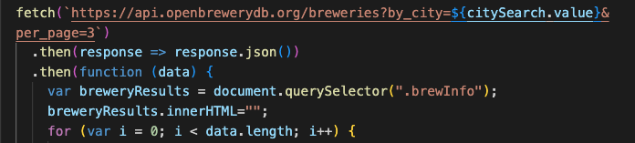
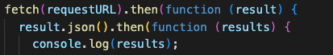

<p align="center">
  <!-- 
</p>


<h1 align="center"> Brews & Chews</h1>

Brews & Chews is a website designed with both the extrovert and introvert in mind. Are you looking for fun weekend plans? Or want to enjoy some adult beverages in a new city but not sure where to go? If you've answered 'Yes' to either question, then our website is for you! Within the brewery search button, you can easily type in your desired city (as long as it's within the United States), and a list of local breweries within the area will appear. All of the important details, like name, address, phone number and website will be at your fingertips with just one click! Now, if you answered 'No' to either or both questions mentioned above, don't worry, because there's still something useful for you too. If you're more of a homebody, you can still enjoy our website by looking up fun recipes with a simple search. All you have to do is type in a food item that you enjoy, click 'Get Recipe' and a new recipe will appear with a picture of what it should look like! If you want more, just click 'Next' and more tasty recipes are headed your way. That's not all though! While you're cooking, feel free to take a fun quiz about beer, and after you've enjoyed your delicious dinner, leave a suggestion for our website! 

<h1 align="center"> Getting Started</h1>

This project, much like the food we hope you'll have fun creating, was made with love! It was a collaborative effort, and took plenty of communication, organization, flexibility and optimism to get the end result. 


<h2 align="center"> User Stories</h2>


1. The user can type the name of a city within the United States, into the brewery search bar.
2. The user will have access to a list of names of local breweries within the searched city.
3. The user will view the following details of each brewery that appears- the name of the brewery, address, phone number and website link.
4. Their city searches will be stored. 
5. The user will also be able to take a fun facts quiz related to beer. 
6. The user can also type in a food item within the food search bar. 
7. The user will have access to recipes that include the food item after they click the button, 'Get Recipe'. The recipes will appear one at a time. 
8. The user can view other recipes by clicking, the 'Next' button.
9. The user will also be able to provide suggestions by accessing a form to input their information. 


<h2 align="center"> APIs</h2>

Once our group decided on what the purpose of our website should be, it was time to find the right APIs to carry out our plan. As a team, we looked through various APIs related to food and alcohol. We ultimately decided on the following two APIs:

+ [Open Brewery](https://www.openbrewerydb.org/documentation#by_city)

- [Spoonacular](https://spoonacular.com/food-api)

We chose [Open Brewery](https://www.openbrewerydb.org/documentation#by_city) for the alcoholic beverages because it provided the social aspect that we were looking for, for our users. When people attend a brewery it's an experience. It's a way to bond with friends, and mix and match your favorite beers with new ones that sound appealing! We believe that everyone should have that opportunity to let loose in their city, which is why chose to use the local brewery by city API. 

With our beverage API selected, it was now time to find one related to food, which is where [Spoonacular](https://spoonacular.com/food-api) comes into play. We knew from the beginning that we wanted to provide a culinary experience as well. We talked about the responsibilities of being an adult, and having to cook. It's so easy to get into a culinary rut. However, with our website, a user can just as easily break free, and try new recipes in the comfort of their own home. The best part is that even if you may not know exactly what recipe to do, the API does the thinking for you! All you have to do is type in a food item that you're craving, and a recipe will appear. If you don't like the first one, then just select, 'Next', and another recipe will pop up. 

Our next step was to create successful [fetch's](https://developer.mozilla.org/en-US/docs/Web/API/Fetch_API) to both APIs. 

```
Open Brewery Fetch
```

```
Spoonacular Fetch
```




<h2 align="center"> </h2>


<h1 align="center"> View our Demo! </h1>


<h2 align="center">
 Find a brewery </h2>


<p align="center">
  
</p>

___
<h2 align="center">
 Find a food recipe </h2>


<p align="center">
  
</p>

___

<h2 align="center"> Take a quiz! </h2>

ENTER GIF HERE

<!-- <p align="center"> -->
</p>

_ _ _

<h2 align="center"> Make a suggestion</h2>

ENTER GIF HERE


<p align="center">
<!-- </p> -->

<h4 align="center"></h4>


_ _ _

<h1 align="center">Technologies</h1>

+ JavaScript
- [Bulma](https://bulma.io/documentation/) 
+ [Open Brewery](https://www.openbrewerydb.org/documentation#by_city)
- [Spoonacular](https://spoonacular.com/food-api)
+ VS Code
- GIPHY CAPTURE
+ Questions courtesy of [Beer Trivia](https://triviaearth.com/trivia/beer-trivia)

---

<h1 align="center">Brews & Chews Deployed Link</h1>

[Deployed Link](https://anthony-furjanic.github.io/brewsandchews/)


<p>Thanks for taking the time to view our site! We hope you enjoy &#128515;</p>


<h1 align="center">Creators</h1>

+  Michele Tornetta: [Github](https://github.com/MicheleTornetta)
+  Amy Lipscomb: [Github](https://github.com/AmyLipscomb)
+  Cassandre Beauzil : [Github](https://github.com/Cassandre0617)
+  Anthony Furjanic: [Github](https://github.com/Anthony-Furjanic)
+  Ramsey Banda: [Github](https://github.com/DummyWoke)

